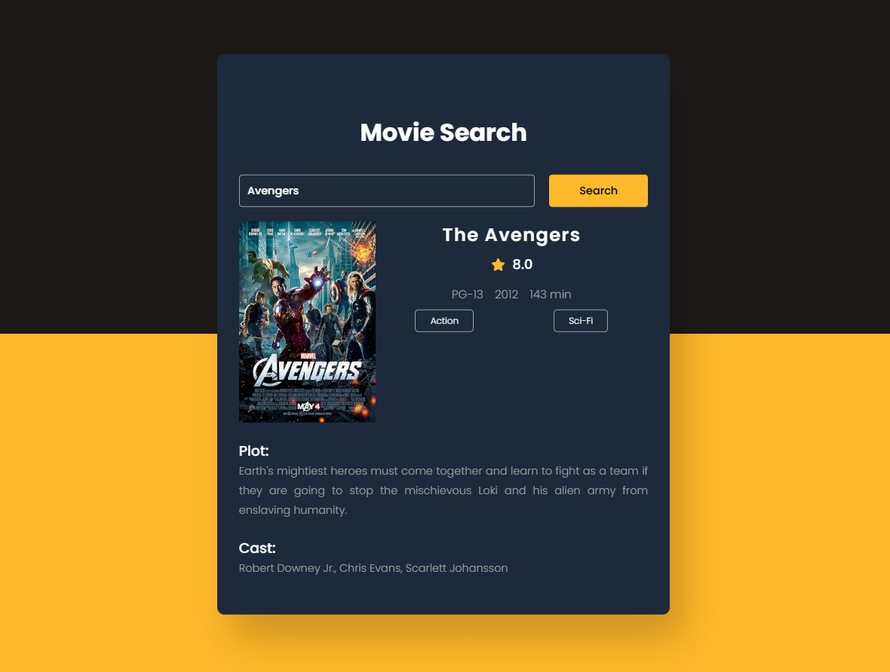

# Movie Guide App 🎥

A sleek and responsive web application to search for movie details using the **OMDb API**. Simply enter a movie name, and the app will fetch detailed information such as ratings, cast, plot, runtime, and more! 🌟

---

## 📋 Features

- **Search Movies Instantly:** Enter a movie name to get detailed information.
- **Interactive User Interface:** Intuitive design with responsive elements.
- **Dynamic Genre Display:** Genres displayed as neat, styled tags.
- **Rating Visualization:** IMDb rating accompanied by a star icon.
- **Error Handling:** Friendly messages for invalid or empty searches.

---

## 🛠️ Tech Stack

### Frontend
- **HTML5:** Semantic structure.
- **CSS3:** Styled with responsive design and a modern aesthetic.
- **JavaScript (ES6):** Dynamic interactions and API integration.

### API
- **OMDb API:** Fetching movie details.

---

## 🖼️ Screenshots

### Home Screen

<div style="display:flex; justify-content:center;">
    
</div>


---

## 🚀 How to Run Locally

1. Clone the repository:
   ```bash
   git clone https://github.com/Bloivating-Major/50-Projects-Using-HTML-CSS-JS.git
   ```

2. Navigate to the project directory:
   ```bash
   cd 11 Day 10 Movie Guide App
   ```

3. Open the `index.html` file in your browser.

4. Ensure you have an API key from [OMDb API](http://www.omdbapi.com/) and save it in a `key.js` file as:
   ```javascript
   const key = "YOUR_API_KEY";
   ```

---

## 🖌️ Design Highlights

- **Color Palette:**
  - Background: Gradient from dark to vibrant orange.
  - Text: Contrasting white and subtle gray for details.

- **Typography:**
  - Font: "Poppins" for a modern, clean look.

- **Responsive Design:**
  - Mobile-first approach ensuring compatibility across devices.

---

## 🔍 Code Overview

### **HTML**
- Simple and semantic structure for easy navigation.

### **CSS**
- Flexbox and Grid for layout.
- Media queries for responsiveness.
- Styling for genres, buttons, and movie details.

### **JavaScript**
- Event listeners for fetching data dynamically.
- Error handling and fallback UI.

---

## 🤝 Contribution Guidelines

We welcome contributions! Here’s how you can help:

1. Fork this repository.
2. Create a new branch:
   ```bash
   git checkout -b feature-branch
   ```
3. Commit your changes:
   ```bash
   git commit -m "Add a new feature"
   ```
4. Push to the branch:
   ```bash
   git push origin feature-branch
   ```
5. Submit a pull request.

---

## 🌟 Credits

- **OMDb API:** For providing an excellent movie database.
- **Icons:** Star icon sourced from [Font Awesome](https://fontawesome.com/).
- **Inspiration:** Your creativity!

---

## 💬 Feedback

We’d love to hear your thoughts about the Movie Guide App! If you have any suggestions, feel free to open an issue or contact us.

---

### Made with ❤️ by Bloivating Major

