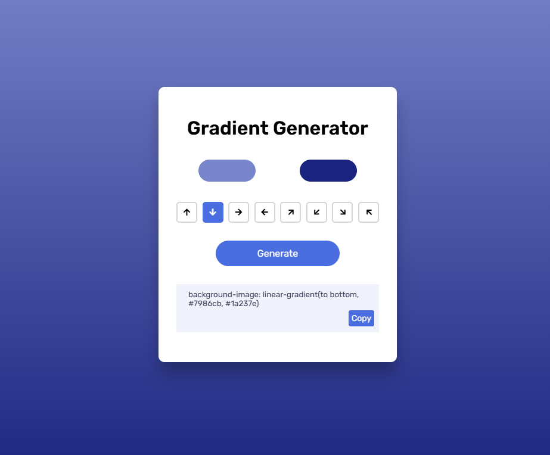

# 🎮 Day #11 - Gradient Generator 🎮

# 🌈 Gradient Generator

**Gradient Generator** is an interactive tool that allows users to create stunning CSS linear gradients with ease. Experiment with colors, directions, and generate gradient codes instantly to beautify your projects!

---

## 🚀 Features

- 🎨 **Color Picker**: Select two colors to create a gradient.
- 📐 **Direction Control**: Choose gradient directions with simple arrow buttons.
- 🛠️ **Code Generator**: Generate CSS gradient code instantly.
- 📋 **Copy Feature**: Copy the generated code to your clipboard with one click.

---


## 🛠️ Technologies Used

- **HTML**: Structure the content and layout.
- **CSS**: Style the gradient generator for a modern and clean look.
- **JavaScript**: Enable dynamic functionality and interactivity.

---

## 📂 Project Structure

```
Gradient Generator
├── index.html         # Main HTML file
├── style.css          # CSS styles
├── script.js          # JavaScript for functionality
```

---

## 📜 How to Use

1. **Pick Colors**: Select your desired colors using the color pickers.
2. **Set Direction**: Choose the gradient direction by clicking the arrow buttons.
3. **Generate Code**: Click the `Generate` button to create the CSS gradient code.
4. **Copy and Use**: Copy the code with the `Copy` button and paste it into your project.

---


## 📸 Screenshots

<div style="display:flex; justify-content:center;">
    
</div>

---

## 🎯 Goals and Learning Outcomes

- Understand CSS gradients and their properties.
- Work with color pickers and directional controls.
- Practice DOM manipulation using JavaScript.
- Create a visually appealing and functional UI.

---

## 🧑‍💻 Author

**Bloivating Major**  
- GitHub: [Bloivating Major](https://github.com/Bloivating-Major)  

---


Happy Coding! 🎉
