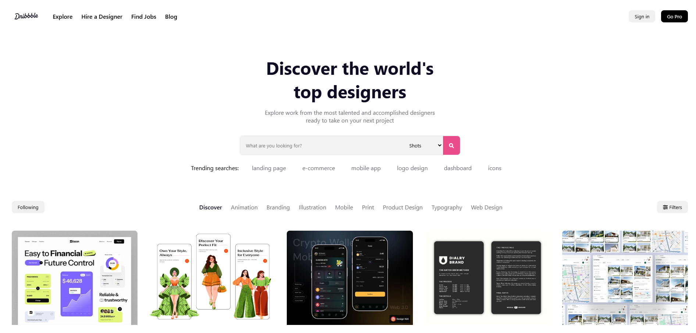
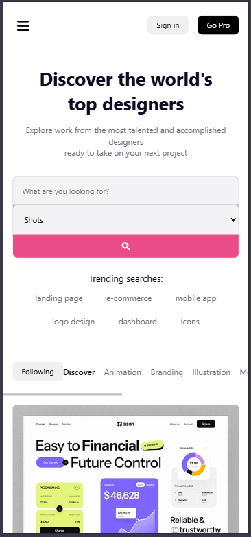

---  

# 🎨 Day #13 - Dribbble Clone 🎨  

A responsive web page inspired by **Dribbble**, showcasing top designers and their creative work. This project focuses on a visually appealing layout, user interactivity, and responsiveness, making it a perfect practice in modern web design techniques.  

---  

## 📌 Features  

### 🌐 **Navigation Bar**  
- **Responsive Design:** Adapts seamlessly across devices, with a mobile menu toggle for smaller screens.  
- **Functional Links:** Includes "Explore," "Hire a Designer," "Find Jobs," and "Blog" navigation options.  

### ✨ **Hero Section**  
- **Highlight Message:** Displays a welcoming title and description about the platform.  
- **Search Bar:**  
  - Input field for user queries.  
  - Dropdown menu for category selection.  
  - Search button for quick actions.  
- **Trending Searches:** Showcases clickable tags for popular design topics.  

### 🔎 **Filter Section**  
- **Category Filters:** Categories like "Discover," "Animation," "Branding," and others allow easy navigation.  
- **Active State Indicator:** Highlights the selected filter for better user experience.  

### 🖼️ **Dynamic Gallery**  
- **Designer Projects:** Showcases project images with titles, designer names, likes, and views.  
- **Dynamic Rendering:** Content is rendered using JavaScript for real-time updates.  

---  

## 🛠️ Tech Stack  

### Frontend:  
- **HTML5:** For structuring the layout.  
- **CSS3:**  
  - Media queries ensure responsiveness.  
  - Flexbox is used for clean, consistent layouts.  
- **JavaScript:** For interactivity and dynamic content rendering.  
- **Font Awesome:** Icons for navigation and gallery stats.  

### Assets:  
- Custom **SVG logo** and high-quality images for visual appeal.  
- Locally stored and externally sourced images for the gallery.  

---  

## 🗂️ File Structure  

```
Dribbble Clone/
├── assets/
│   ├── Dribbble New 2023.svg
│   ├── img1.webp
│   ├── desktop-view.png
│   ├── mobile-view.png
├── styles.css
├── script.js
├── index.html
```  

---  


## 💡 Key Functionalities  

- **Dynamic Gallery:**  
  - The gallery is generated dynamically using the `galleryItems` array in `script.js`.  
  - Each item includes an image, title, designer name, likes, and views.  

- **Search Functionality:**  
  - The search bar captures user input (currently logs input for demonstration).  

- **Filter Selection:**  
  - Clicking on a filter updates its active state and logs the selected category.  

- **Mobile Navigation:**  
  - The menu toggle ensures usability on smaller screens.  

- **Responsive Layout:**  
  - CSS media queries make the web page accessible on desktops, tablets, and phones.  

---  

## 🎯 Future Enhancements  

- **Real Data Integration:** Use backend APIs to fetch real-time data for designers and their projects.  
- **Advanced Search Filters:** Add sorting and filtering options for a more refined search experience.  
- **Accessibility Improvements:** Implement ARIA roles and better keyboard navigation.  
- **Smooth Animations:** Add transitions and hover effects for enhanced interactivity.  

---  

## 📸 Screenshots  

### Desktop View  
  

### Mobile View  
  

---  

## 📜 License  

This project is licensed under the MIT License.  

---  

Feel free to **fork, improve, and contribute** to this project. Your feedback is always welcome! 🚀