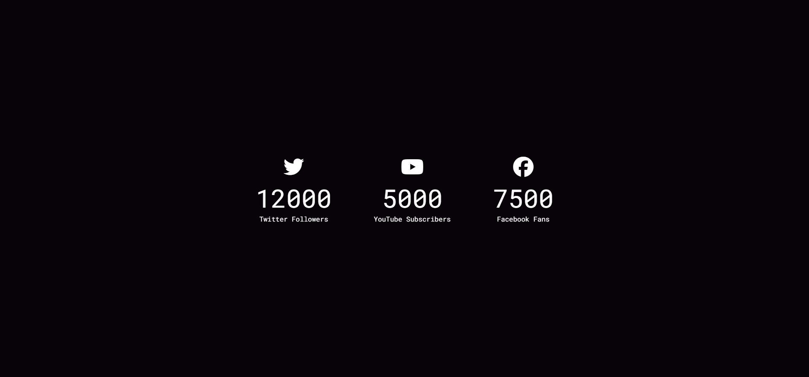
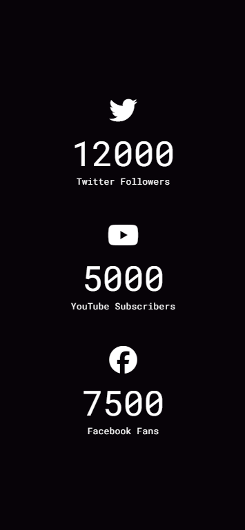

# 🎉 Day #14 - Incrementing Counter 🎉  

A simple and engaging **Incrementing Counter** project built with HTML, CSS, and JavaScript! This project features counters that animate from 0 to their target values, showcasing real-time growth for social media stats like Twitter followers, YouTube subscribers, and Facebook fans. 🚀  

---  

## ✨ Features  

- **Dynamic Counter Animation**:  
  - Smoothly increments numbers from `0` to their target values using JavaScript.  
- **Social Media Icons**:  
  - Integrated with **Font Awesome** to display Twitter, YouTube, and Facebook icons.  
- **Responsive Design**:  
  - Fully responsive layout, optimized for both desktop and mobile screens.  
- **Dark Aesthetic**:  
  - Eye-catching dark-themed background with modern typography.  

---  

## 🛠️ Technologies Used  

- **HTML5**: To structure the layout.  
- **CSS3**: For the dark theme and responsive styling.  
  - Google Fonts for modern typography.  
  - Media queries for mobile responsiveness.  
- **JavaScript**: For dynamically updating counter values.  
- **Font Awesome**: For attractive social media icons.  

---  

## 🗂️ File Structure  

```
Incrementing Counter/
├── index.html       # Main HTML file
├── style.css        # Styling for the project
├── script.js        # JavaScript logic for counters
```  

---  

## 🚀 How to Run  

1. **Clone the Repository**:  
   ```bash  
   git clone <repository_url>  
   ```  

2. **Navigate to the Project Directory**:  
   ```bash  
   cd Incrementing-Counter  
   ```  

3. **Open the HTML File**:  
   Open `index.html` in your favorite browser to see the magic!  

---  

## 🌟 Key Functionalities  

- **Counter Animation Logic**:  
  - JavaScript dynamically updates each counter by incrementing values over time until the target value is reached.  
  - Uses the `data-target` attribute to specify the desired target value.  

- **Responsive Layout**:  
  - Ensures the layout adapts perfectly for different screen sizes using **CSS media queries**.  

- **Customizable**:  
  - Easily update the target values, icons, or labels by editing the `data-target` attribute or HTML content.  

---  

## 📸 Screenshots  

### Desktop View  
  

### Mobile View  
  

---  

## 🎯 Future Enhancements  

- Add **user input functionality** to customize counters dynamically.  
- Implement **API integration** to fetch real-time social media stats.  
- Add more **animations** for counters (e.g., bounce, fade-in effects).  
- Improve **accessibility** with ARIA roles and better keyboard navigation.  

---  

## 📜 License  

This project is licensed under the **MIT License**. Feel free to use and modify it as per your needs!  

---  

## 🙌 Acknowledgments  

- **Font Awesome** for providing amazing icons.  
- **Google Fonts** for the beautiful Roboto Mono typography.  

---  

Feel free to fork, contribute, or provide feedback for future improvements! 🌟  